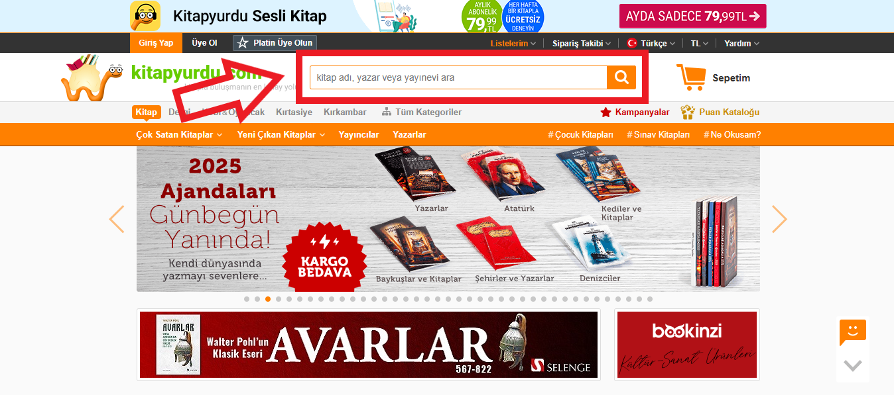
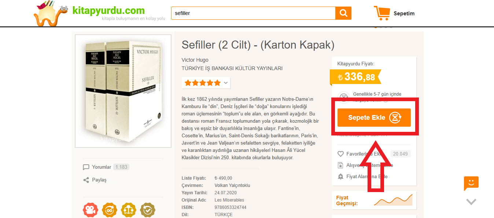
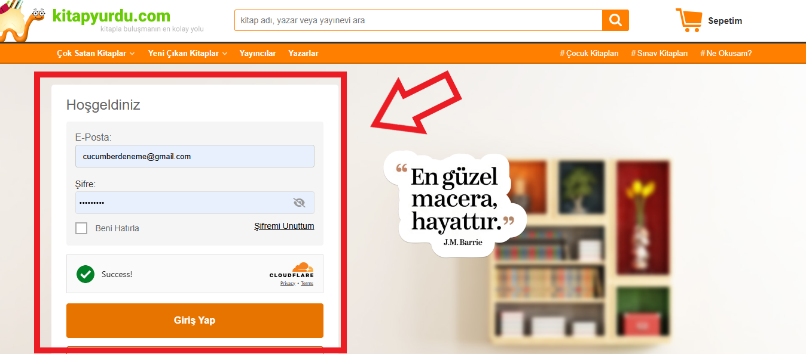
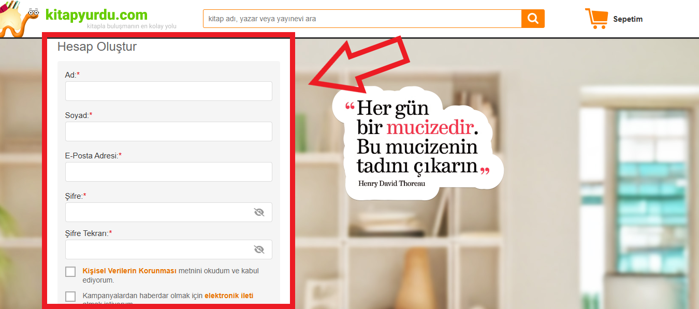
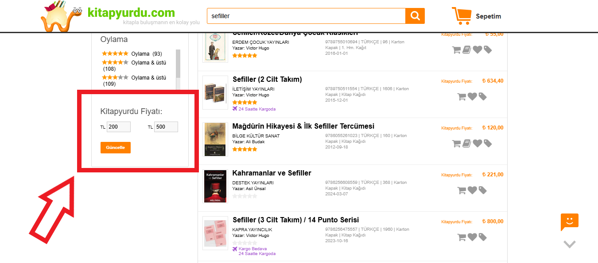
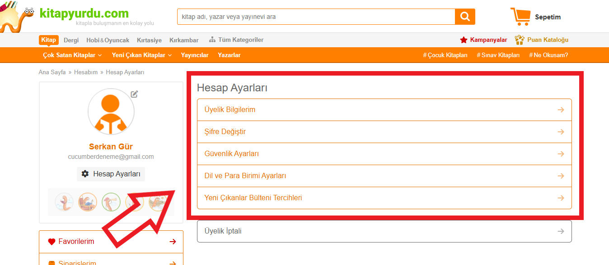

# 📚 Kitap Yurdu Framework Projesi

Bu proje, Kitap Yurdu web sitesindeki kullanıcı deneyimini test etmek amacıyla hazırlanmış bir **otomasyon test frameworküdür**. Kullanıcıların en sık etkileşimde bulunduğu alanlar için **test senaryoları ve test caseler** yazılmış, ardından bunların çalıştırılması sağlanmıştır.

---

## 🧪 Test Edilen Özellikler

Aşağıdaki fonksiyonel alanlar için test senaryoları oluşturulmuştur:

- 🔍 **Kitap Arama** (`BookSearch.feature`)
- ➕ **Sepete Kitap Ekleme** (`CartAdd.feature`)
- 🔐 **Kullanıcı Girişi** (`Login.feature`)
- 📝 **Yeni Kullanıcı Kaydı** (`NewUserRegistration.feature`)
- 💰 **Fiyat Aralığı Filtreleme** (`PriceFilter.feature`)
- 👤 **Kullanıcı Profil Yönetimi** (`UserProfileManagement.feature`)

---

## ⚙️ Kullanılan Teknolojiler ve Araçlar

- 🟨 Java  
- 🧪 Selenium WebDriver  
- 🥒 Cucumber  
- ✅ TestNG & JUnit  
- 🎲 JavaFaker (test verisi üretimi)
- 🧾 JSON-simple – JSON veri okuma ve yazma
- 📊 Cucumber Reporting – Test sonuçları için detaylı HTML raporlama


---

## 🛠️ Projeyi Klonlayın ve Çalıştırın

Projeyi kendi bilgisayarınızda çalıştırmak için:

1. Bu projeyi GitHub üzerinden klonlayın:

```bash
git clone https://github.com/Serkangur/Kitap_Yurdu_Framework.git
```
---

## 📬 İletişim

Benimle iletişime geçmek istersen:

- 💼 [LinkedIn Profilim](https://www.linkedin.com/in/serkan-g%C3%BCr-a0817420b/)
- 📧 E-posta: serkangur002@gmail.com


## 🖼️ Ekran Görüntüleri

Aşağıda, test edilen bazı senaryolara ait ekran görüntülerini bulabilirsiniz:

### 🔍 Kitap Arama (`BookSearch.feature`)


### ➕ Sepete Kitap Ekleme (`CartAdd.feature`)


### 🔐 Kullanıcı Girişi (`Login.feature`)


### 📝 Yeni Kullanıcı Kaydı (`NewUserRegistration.feature`)


### 💰 Fiyat Aralığı Filtreleme (`PriceFilter.feature`)


### 👤 Kullanıcı Profil Yönetimi (`UserProfileManagement.feature`)



